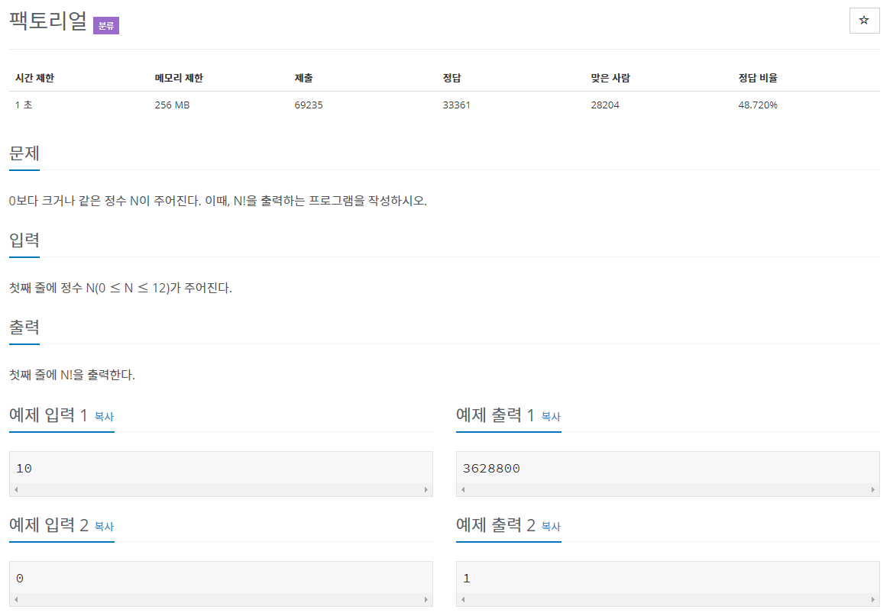

# 문제



# 풀이

```java
package recursion;

import java.io.BufferedReader;
import java.io.IOException;
import java.io.InputStreamReader;

public class N10872 { // 팩토리얼

	public static void main(String[] args) throws NumberFormatException, IOException {

		BufferedReader br = new BufferedReader(new InputStreamReader(System.in));
		int N = Integer.parseInt(br.readLine());
		int Nfac = 1;
		for (int i = 2; i <= N; i++) {
			Nfac *= i;
		}
		System.out.println(Nfac);
	}

}
```

for문을 이용해 1부터 N까지 곱하기 반복해서 출력

```java
import java.io.BufferedReader;
import java.io.IOException;
import java.io.InputStreamReader;

public class test { // 팩토리얼

	public static void main(String[] args) throws NumberFormatException, IOException {

		BufferedReader br = new BufferedReader(new InputStreamReader(System.in));
		int N = Integer.parseInt(br.readLine());
		System.out.println(factorial(N));
	}

	public static int factorial(int N) {
		if (N <= 1) {
			return 1;
		} else {
			return N * factorial(N-1);
		}		
	}

}
```

재귀 호출을 사용해서 factorial(N)메서드에서 factorial(N-1)을 재참조(반복), N≤1이면 반복문 종료. 

# 재귀, 재귀 호출

재귀 : 자신을 정의할 때 자신을 재참조 하는 방법.

재귀 호출 : 함수 내부에서 함수가 자기 자신을 또다시 호출하는 행위, 끝없이 반복하므로 함수 내에 중단되도록 조건이 변경될 명령문을 반드시 포함.

# 참고

>[https://ko.wikipedia.org/wiki/재귀_(컴퓨터_과학)](https://ko.wikipedia.org/wiki/%EC%9E%AC%EA%B7%80_(%EC%BB%B4%ED%93%A8%ED%84%B0_%EA%B3%BC%ED%95%99))

>[https://ko.wikipedia.org/wiki/계승](https://ko.wikipedia.org/wiki/%EA%B3%84%EC%8A%B9)