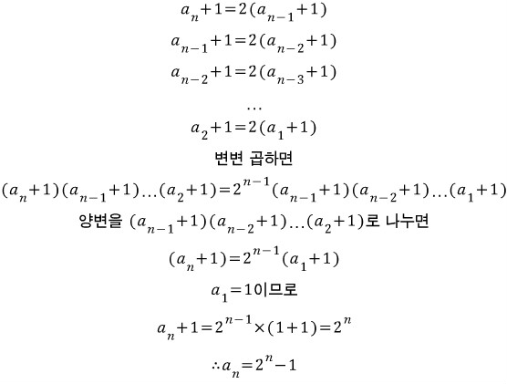

# 문제


# 문제 해석

고등수학에 나오는 하노이의 탑이라는 문제다. 수열을 배울 때 나온다.

또한 하노이의 탑은 재귀호출을 이용하는 가장 유명한 예제중 하나다.

하노이의 탑 문제에서 1번 장대에서 3번 장대로 옳기는 최소 이동 횟수와 이동 과정을 계산해보자.

(본래 하노이의 탑 문제는 기둥 3개인 것은 동일하지만 기둥을 구별 하진 않았다. 즉, 위 알고리즘 문제처럼 '1번 장대(기둥)에서 3번 장대(기둥)으로 옳긴다' 라는 조건은 없다.)

N개의 원판을 옳길 때 거치는 과정을 다음 3단계로 나눌 수 있다.

1. 1번 장대에 쌓여있는 N-1개의 원판을 2번 장대로 옳긴다.
2. 1번 장대의 N번 원판을 3번 장대로 옳긴다.
3. 2번 장대에 쌓여있는 N-1개의 원판을 3번 장대로 옳긴다. 

### 예시 N=5일 때

시작 전)


1 단계)


2 단계)


3 단계)


## 점화식

하노이의 탑은 점화식으로 표현이 가능하다. 

1단계를 거치는 최소 이동 횟수는 N-1개의 원판을 다른 곳에 옳기는 것이므로 a(N-1)번이다.

그리고 2단계를 거치며 필요한 이동 횟수는 1번이다.

3단계에서는 N-1개의 원판을 이동시키는 것이므로 다시 a(N-1)번이다. 

점화식 : a(N) = a(N-1) + 1 + a(N-1) = aN - a + 1 + aN - a = 2aN - 2a + 1 = 2a(N-1) + 1 

### 결론

아래의 계산을 거치고 나면 N개의 원판의 최소 이동홧수 = 2의 N거듭제곱 - 1 이라는 공식이 나온다



>참고 : [http://blog.naver.com/PostView.nhn?blogId=2gumin14&logNo=221060149259](http://blog.naver.com/PostView.nhn?blogId=2gumin14&logNo=221060149259)

추가로 우리는 이러한 최소 이동횟수 뿐만 아니라 이동의 과정까지 출력해야 된다.

## 이동과정

이동과정은 위에서 3단계로 분류했던 것을 참고한다. 

N개의 원판을 옳길 때 거치는 과정을 다음 3단계로 나눌 수 있다.

1. 1번 장대에 쌓여있는 N-1개의 원판을 2번 장대로 옳긴다.
2. 1번 장대의 N번 원판을 3번 장대로 옳긴다.
3. 2번 장대에 쌓여있는 N-1개의 원판을 3번 장대로 옳긴다. 

N이 2, 3일 때의 이동 과정 단계별로 나누어 살펴보자.


살펴보니 재귀의 과정을 사용하면 된다. N=2일때의 과정을 N=3일 떄의 1단계와 3단계가 참조하고 있다. 즉 N-1의 이동과정을 N과정의 1단계와 3단계가 재귀호출(참조)한다. 

2단계는 1번 장대의 N번 원판을 비어있는 3번 장대로 옳기는 과정 이므로 1 3 고정이다. 

### 결론

1단계에서 2와 3이 호환 된다. (주기가 2인 치환은 상호교환에서 한 글자씩 따와 호환이라고 한다.) 2단계는 고정이고 3단계에서 1과 2가 호환된다.

### 참고

범위를 넓혀 N이 2~5일 떄의 과정을 살펴보자.


N=5일 때까지 N의 이동과정은 N-1의 이동과정을 1,3단계에서 참조하고 있다.

# 풀이

하노이의 탑의 최소이동횟수는 2의 N거듭제곱 - 1을 구하면 되므로 Math.pow함수를 쓰면 쉽게 구할 수 있다.

최소이동횟수 = `(int) (Math.pow(2, N) - 1)` 

이동과정을 구하기 위해 towerOfHanoi(int N, int A, int B, int C)라는 메소드를 만들었다

towerOfHanoi(N, A, B, C)함수는 3단계를 거쳐 이동과정을 구할 수 있다.

1. towerOfHanoi(N-1, A, C, B) 함수 참조 (  2, 3 호환 N-1함수 호출 )
2. A C (1번 장대에 하나 남은 N번 원판을 3번 장대로 옳긴다. 고정(상수))
3. towerOfHanoi(N-1, B, A, C) 함수 참조 ( 1, 2 호환  N-1함수 호출 )

이렇게 2단계는 고정이고 1, 3단계에서 재귀 호출한다.

```java
static void towerOfHanoi(int N, int A, int B, int C) {
		towerOfHanoi(N - 1, A, C, B);
		System.out.println(A + " " + C);
		towerOfHanoi(N - 1, B, A, C);
	}
```

이제 towerOfHanoi(N, 1, 2, 3) 을 실행 시키기 위해 (N개의 원판, A, B, C 기둥의 이름을 1, 2, 3으로)

참조하고 반복문을 종료할 조건문을 넣어준다. N==1일 때를 기준으로 넣어주면 된다. 원반이 하나일 때는 당연하게도 이동과정은 1 > 3 한 번이다.

```java
		if (N == 1) {
			System.out.println(A + " " + C); // N=1일때 이동과정 : 1 3 ... A C 출력
			return;
		}
```

## 전체 코드

```java
package recursion;

import java.io.BufferedReader;
import java.io.IOException;
import java.io.InputStreamReader;

public class N11729 { // 하노이 탑 이동 순서

	static StringBuilder sb = new StringBuilder();

	public static void main(String[] args) throws NumberFormatException, IOException {

		BufferedReader br = new BufferedReader(new InputStreamReader(System.in));
		int N = Integer.parseInt(br.readLine());
		int K = (int) (Math.pow(2, N) - 1); // 옳긴 횟수
		sb.append(K + "\n");
		TowerOfHanoi(N, 1, 2, 3); // N개의 원판, 장대 이름은 각각 1, 2, 3
		System.out.println(sb);
	}

	// 하노이의 탑 - N개의 원판을 A번쨰 탑과 B번째 탑으로 옳기는 과정 계산, 출력 함수
	public static void TowerOfHanoi(int N, int A, int B, int C) {
		// 스택 참조 및 반복문 종료
		if (N == 1) {
			sb.append(A + " " + C + "\n");
		} else {
			TowerOfHanoi(N - 1, A, C, B); // 2, 3 호환
			sb.append(A + " " + C+ "\n"); // 1 3 고정(상수)
			TowerOfHanoi(N - 1, B, A, C); // 1, 2 호환
		}
	}

}
```

입력은 BufferReader로 받았다.

출력은 처음에는 syso으로 출력했지만 시간 초과가 나와서 StringBuilder 를 사용했다.

# 타인의 답

```java
import java.io.*;

public class test {
	static int count = 0;
	static StringBuilder sb = new StringBuilder();

	static void hanoi(int start, int stopover, int end, int n) {
		if (n == 1) {
			move(start, end, n);
			return;
		} else {
			hanoi(start, end, stopover, n - 1);
			move(start, end, stopover);
			hanoi(stopover, start, end, n - 1);
		}
	}

	static void move(int start, int end, int n) {
		sb.append(start);
		sb.append(' ');
		sb.append(end);
		sb.append('\n');
		count++;
	}

	public static void main(String[] args) throws IOException {
		BufferedReader br = new BufferedReader(new InputStreamReader(System.in));
		int n = Integer.parseInt(br.readLine());
		hanoi(1, 2, 3, n);
		System.out.println(count);
		System.out.print(sb);	
	}

}
```

최소 이동횟수는 공식을 사용하지 않고 함수의 작동 횟수를 count변수에 넣고 출력했다.

move 메소드를 추가로 만들어 count로 최소 이동횟수를 계산하고 2단계 고정 상수 값을 입력했다.

# 참고

>[http://blog.naver.com/PostView.nhn?blogId=2gumin14&logNo=221060149259](http://blog.naver.com/PostView.nhn?blogId=2gumin14&logNo=221060149259)

>[https://www.geeksforgeeks.org/iterative-tower-of-hanoi/](https://www.geeksforgeeks.org/iterative-tower-of-hanoi/)

>[https://ko.wikipedia.org/wiki/하노이의_탑](https://ko.wikipedia.org/wiki/%ED%95%98%EB%85%B8%EC%9D%B4%EC%9D%98_%ED%83%91)