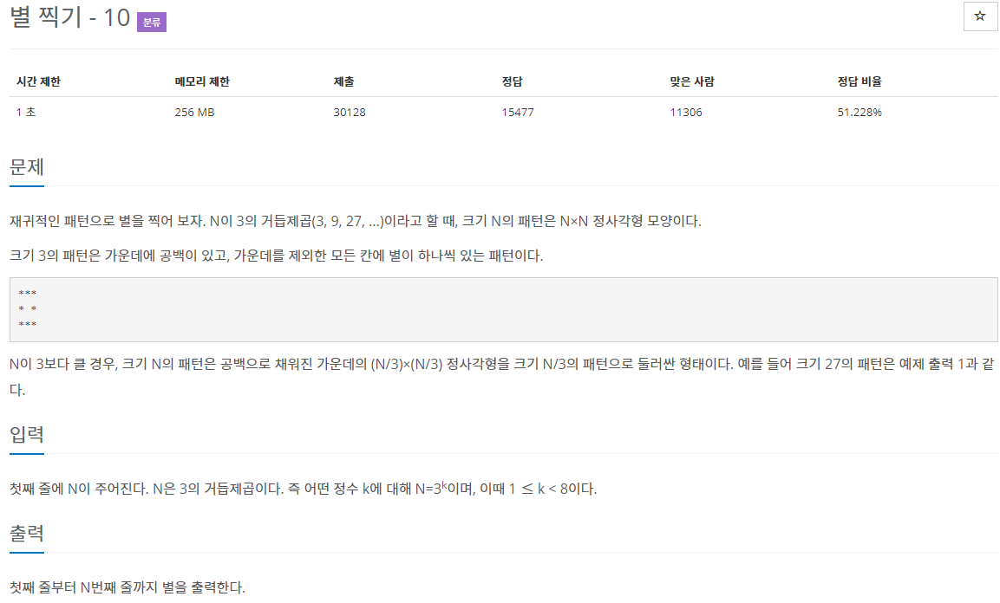
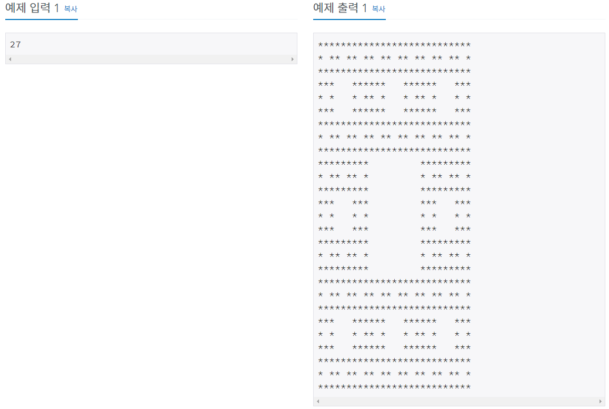
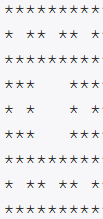
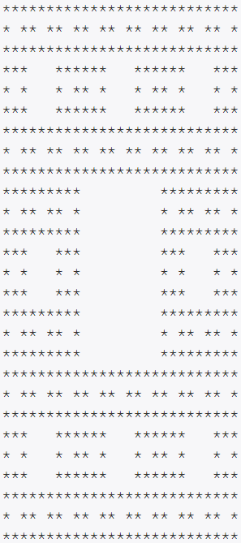
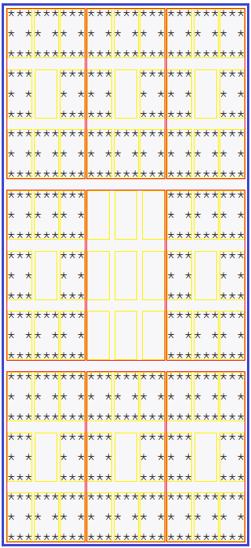

# 문제





# 풀이

3의 거듭제곱수인 N을 입력하면 *별의 패턴을 출력하는 문제이다.

크기 N의 패턴은 공백으로 채워진 가운데의 (N/3)*(N/3) 정사각형을 크기 N/3의 패턴으로 둘러싼 형태이다.

예를 들어 N = 3이면


N = 9면



N = 27이면



### 패턴 분석

N=27일 때의 패턴을 분석해보자

패턴을 분석하기 위해 색이 다른 사각형으로 구분해줬다.

파란색 사각형은 N=27,

빨간색 사각형은 N=9,

노란색 사각형은 N=3인 경우의 패턴이다.



N의 패턴은 3행3열의 사이즈로 N/3의 패턴을 출력하되 가운데만 공백으로 한다.

단 N=3의 패턴은 3행3열의 사이즈로 *을 출력하되 가운데만 공백으로 한다.

### 스택 프레임

이러한 패턴은 역시 재귀를 이용하면 된다. 즉, 스택프레임에 함수가 호출될 때마다 데이터를 저장해서 그 데이터를 3x3행렬에 저장해서 출력해주면된다. 그리고 조건문을 사용해 가운데를 공백으로 출력되게끔 만든다.

스택프레임을 구성하여 재귀호출을 하기 위해서 x, y, size와 같은 변수를 사용해야 한다.

길이가 27이고 인덱스가 (0, 0)으로 시작하고 크기가 27인 별의 패턴은 아래와 같이 분할 된다.

위 그림의 빨간색 박스들을 보면된다.

(x, y, 크기) :

(0, 0, 9)    (0, 9, 9)    (0, 18, 9)

(9, 0, 9)    (9, 9, 9)    (9, 18, 9), 

(18, 0, 9)  (18, 9, 9)  (18, 18, 9)

이렇게 9개의 좌표및 크기로 스택프레임을 표현할 수 있다.

또 길이가 9인 패턴을 길이가 3인 패턴으로 분할하면,

위 그림의 노란색 박스들을 보면된다.

(x, y, 크기) :

(0, 0, 3)    (0, 3, 3)    (0, 6, 3)

(3, 0, 3)    (3, 3, 3)    (3, 6, 3), 

(6, 0, 3)    (6, 3, 3)    (6, 6, 3)

이렇게 나뉘게 되는데 이런 식으로 노란색 박스는 81개가 나온다.

이로서 알 수 있는 것은

중요한 것은 재귀 호출 되는 부분의 N은 N/3이 된다는 것과

배열의 x, y 인덱스를 보면 0*N, 1*N, 2*N 이렇게 호출이 된다. (N=9일 때 0, 9 , 18 / N=3일 때 0, 3, 6)

# 풀이

```java
import java.io.BufferedReader;
import java.io.BufferedWriter;
import java.io.InputStreamReader;
import java.io.OutputStreamWriter;
import java.util.Arrays;

public class Main { // 별 찍기 - 10

	static char[][] arr; // 2차원 배열

	public static void main(String[] args) throws Exception {
		//입력
		BufferedReader br = new BufferedReader(new InputStreamReader(System.in));
		BufferedWriter bw = new BufferedWriter(new OutputStreamWriter(System.out));
		int N = Integer.parseInt(br.readLine());
		arr = new char[N][N]; // N*N 행렬의 2차원 배열

		// 함수 초기화
		for (int i = 0; i < N; i++) {
			Arrays.fill(arr[i], ' ');
		}
		// 함수 실행
		starPattern(0, 0, N);

		//출력
		for (int i = 0; i < N; i++) {
			bw.write(arr[i]);
			bw.write("\n");
		}
		bw.flush();
		bw.close();
	}

	public static void starPattern(int x, int y, int size) {
		// 역순으로 프로그램이 *을 채워 넣고 종료
		if (size == 1) {
			arr[x][y] = '*';
			return;
		}

		// 재귀 함수
		for (int i = 0; i < 3; i++) {
			for (int j = 0; j < 3; j++) {
				if (i * j == 1) // [1,1]은 공백
					continue; // 건너뜀
				starPattern(x * 3 + i, y * 3 + j, size / 3);
			}
		}
	}
}
```

# 코드 분석

### 2차원 배열 사용

먼저 전역 변수로 arr 2차원 배열을 생성한다. 

```java
public class Main { // 별 찍기 - 10

	static char[][] arr; // 2차원 배열

	public static void main(String[] args) throws Exception {
		//입력
		BufferedReader br = new BufferedReader(new InputStreamReader(System.in));
		BufferedWriter bw = new BufferedWriter(new OutputStreamWriter(System.out));
		int N = Integer.parseInt(br.readLine());
		arr = new char[N][N];
```

### 함수 초기화

Arrays.fill을 이용해 arr 2차원 배열을 ' '공백으로 채워넣는다.

```java
	for (int i = 0; i < N; i++) {
			Arrays.fill(arr[i], ' ');
		}
```

### 재귀 함수

N번째 패턴은 3*3인 2차원 배열에서 N/3의 패턴을 반복하므로 (1, 1) 인덱스에서 공백구간이다.

i가 1이고 j가 1일 때 즉, i * j == 1 일 땐  continue로 별찍기를 건너뛰어 공백으로 유지한다.

x, y, size 변수는 위에서 분석한 패턴을 참고해 입력한다.

star(x, y, size) 메소드에서

star(0, 0, N)을 실행하면 입력한 3의 거듭제곱인 N을 3으로 나눈만큼 반복해서 N=1이 되면 중지한다. 여기서 *을 입력해야 스택에 쌓인 데이터로 프로그램이 *을 채워 나간다. (스택은 아래서부터 쌓이고 위에서부터 처리된다 : LIFO 구조 last in, first out.)

```java
	public static void starPattern(int x, int y, int size) {
		// 역순으로 프로그램이 *을 채워 넣고 종료
		if (size == 1) {
			arr[x][y] = '*';
			return;
		}

		// 재귀 함수
		for (int i = 0; i < 3; i++) {
			for (int j = 0; j < 3; j++) {
				if (i * j == 1) // [1,1]은 공백
					continue; // 건너뜀
				starPattern(x * 3 + i, y * 3 + j, size / 3);
			}
		}
	}
```

# 입출력

BufferedReader와 BufferedWriter사용.

```java
public static void main(String[] args) throws Exception {
		// 입력
		BufferedReader br = new BufferedReader(new InputStreamReader(System.in));
		BufferedWriter bw = new BufferedWriter(new OutputStreamWriter(System.out));
		int N = Integer.parseInt(br.readLine());
		arr = new char[N][N]; // N*N 행렬의 2차원 배열

		// 함수 초기화
		for (int i = 0; i < N; i++) {
			Arrays.fill(arr[i], ' ');
		}
		// 함수 실행
		starPattern(0, 0, N);

		// 출력
		for (int i = 0; i < N; i++) {
			bw.write(arr[i]);
			bw.write("\n");
		}
		bw.flush();
		bw.close();
	}
```

2차원 배열 arr[][]은 출력을 arr[]행만을 기준으로 처리할 수 있다. 

이미 데이터는 재귀호출함수를 통해 arr[][]에 쌓여있고 출력시에 행이 바뀔 때마다 \n로 줄바꿈만 해주면 된다. (함수 초기화, 전체 데이터 입력도 중첩for문을 사용하지 않고 행마다 입력했다.)

# 타인의 답

2차원 배열, 재귀를 사용하지 않았다.

중첩 for문안에 solve 메소드를 넣어 2차원 배열처럼 *을 StringBuilder로 저장하고 출력했다.

y % 3 == 1 && x % 3 == 1 라는 조건은 위의 풀이 코드에서 i * j == 1과 마찬가지로 공백인 부분을 조건으로 표현한 것으로 중첩 for문안에서 2차원 배열처럼 solve()메소드를 N*N번 실행해서 공백에 해당하는 조건인 y % 3 == 1 && x % 3 == 1에 해당하면 공백을 추가하고 아니면 *을 추가했다. 메소드를 N*N만큼 사용하는 만큼 N이 커질수록 성능이 더 나빠질 것이다. 

```java
import java.util.Scanner;

public class Main {

	static StringBuilder sb = new StringBuilder();

	public static void main(String[] args) {
		Scanner sc = new Scanner(System.in);
		int n = sc.nextInt();
		for (int i = 0; i < n; i++) {
			for (int j = 0; j < n; j++) {
				solve(i, j);
			}
			sb.append("\n");
		}
		System.out.println(sb.toString());
	}

	static void solve(int y, int x) {
		while (true) {
			if (y == 0)
				break;
			if (y % 3 == 1 && x % 3 == 1) {
				sb.append(" ");
				return;
			}
			y /= 3;
			x /= 3;
		}
		sb.append("*");
	}
}
```

[https://www.acmicpc.net/source/27265663](https://www.acmicpc.net/source/27265663)

# 참고

많은 분들의 자료를 참고하고 공부해서 풀었다. 추가적인 학습 및 복습이 필요하다.

>[https://iseunghan.tistory.com/202](https://iseunghan.tistory.com/202)

>[https://gaebal-goebal.tistory.com/37](https://gaebal-goebal.tistory.com/37)

>[https://iseunghan.tistory.com/202](https://iseunghan.tistory.com/202)

>[https://guk2zzada-second.tistory.com/9](https://guk2zzada-second.tistory.com/9)

>[https://dalconbox.tistory.com/21](https://dalconbox.tistory.com/21)

>[https://velog.io/@sukong/백준-2447-별-찍기10](https://velog.io/@sukong/%EB%B0%B1%EC%A4%80-2447-%EB%B3%84-%EC%B0%8D%EA%B8%B010)

>[https://velog.io/@hammii/백준-2447-별-찍기-10-java](https://velog.io/@hammii/%EB%B0%B1%EC%A4%80-2447-%EB%B3%84-%EC%B0%8D%EA%B8%B0-10-java)

>[https://ko.wikipedia.org/wiki/분할_정복_알고리즘](https://ko.wikipedia.org/wiki/%EB%B6%84%ED%95%A0_%EC%A0%95%EB%B3%B5_%EC%95%8C%EA%B3%A0%EB%A6%AC%EC%A6%98)

>[https://m.blog.naver.com/PostView.nhn?blogId=tlstjd436&logNo=222028743030&proxyReferer=https:%2F%2Fwww.google.com%2F](https://m.blog.naver.com/PostView.nhn?blogId=tlstjd436&logNo=222028743030&proxyReferer=https:%2F%2Fwww.google.com%2F)