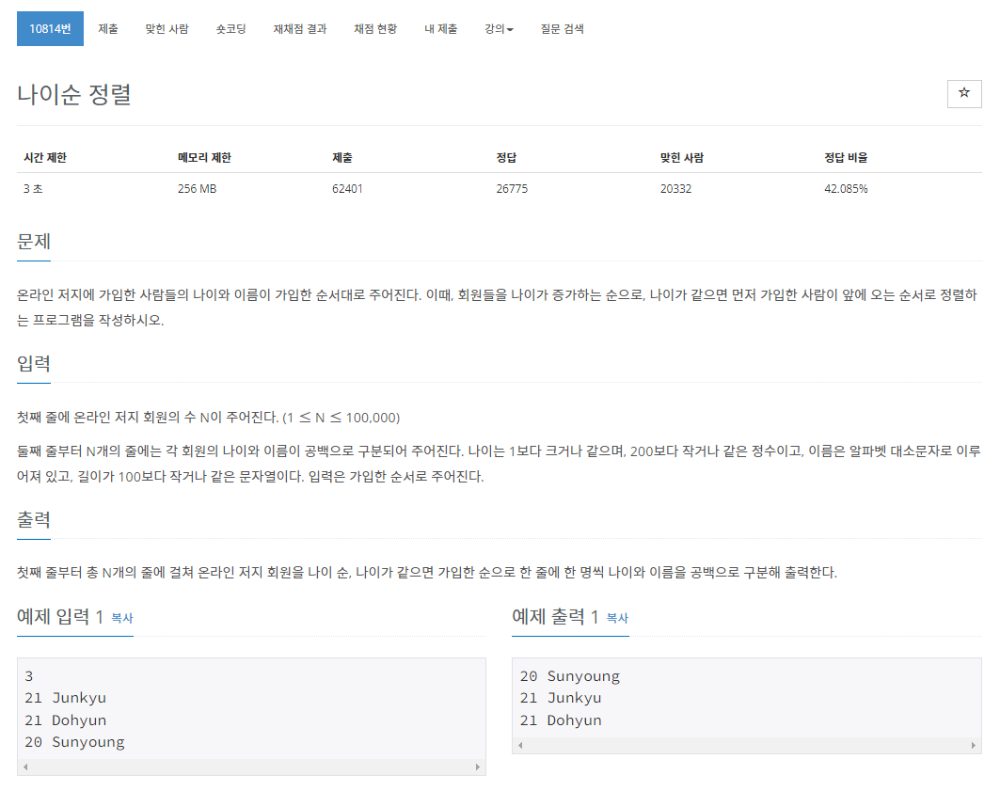
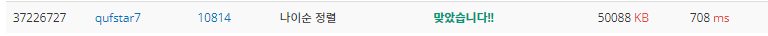

> 백준 알고리즘 - '단계별로 풀어보기'를 기준으로 학습, 정리하였습니다.(https://www.acmicpc.net/)
# 단계 
## 정렬

# N10814 나이순 정렬

## 문제

## 풀이
```java
import java.io.BufferedReader;
import java.io.IOException;
import java.io.InputStreamReader;
import java.util.Arrays;
import java.util.Comparator;
import java.util.StringTokenizer;

public class Main { // 나이순 정렬

	public static void main(String[] args) throws NumberFormatException, IOException {
		BufferedReader br = new BufferedReader(new InputStreamReader(System.in));
		int N = Integer.parseInt(br.readLine());

		String[][] a = new String[N][2];
		StringTokenizer st;
		for (int i = 0; i < N; i++) {
			st = new StringTokenizer(br.readLine());
			a[i][0] = st.nextToken();
			a[i][1] = st.nextToken();
		}

		Arrays.sort(a, new Comparator<String[]>() {
			public int compare(String[] s1, String[] s2) {
				return Integer.parseInt(s1[0]) - Integer.parseInt(s2[0]);
			}			
		});
		
		StringBuilder sb = new StringBuilder();
		for (int i = 0; i < N; i++) {
			sb.append(a[i][0]).append(" ").append(a[i][1]).append("\n");
		}
		System.out.println(sb);
		
	}
}
```

* 입력은 BufferedReader으로 받고 StringTokenizer로 문자열 분리한다.
* 2차원 배열에 값을 저장한다.
* Arrays.sort()를 comparator를 재정의해 나이에 따라 정렬한다.
* StringBuilder로 출력한다.

## 타인의 답 (StringBuilder + 카운팅 정렬)
```java
import java.io.BufferedReader;
import java.io.InputStreamReader;
import java.io.IOException;
import java.util.StringTokenizer;
 
public class Main {
	public static void main(String[] args) throws IOException {
		
		BufferedReader br = new BufferedReader(new InputStreamReader(System.in));
        
		int N = Integer.parseInt(br.readLine());
 
		// 입력되는 나이의 범위 : 1 ~ 200
		StringBuilder[] p = new StringBuilder[201];
		
		//객체배열의 인덱스에 각 StringBuilder 객체를 생성해준다.
		for(int i = 0; i < p.length; i++) {
			p[i] = new StringBuilder();
		}
		
		for(int i = 0; i < N; i++) {
			StringTokenizer st = new StringTokenizer(br.readLine(), " ");
			int age = Integer.parseInt(st.nextToken());
			String name = st.nextToken();
			// 카운팅 정렬 : 나이를 index 로 하여 해당 배열에 나이와 이름을 append() 한다
			p[age].append(age).append(' ').append(name).append('\n');
		}
		
		StringBuilder sb = new StringBuilder();
		for(StringBuilder val : p) {
			sb.append(val);
		}
        
		System.out.println(sb);
	}
}
```