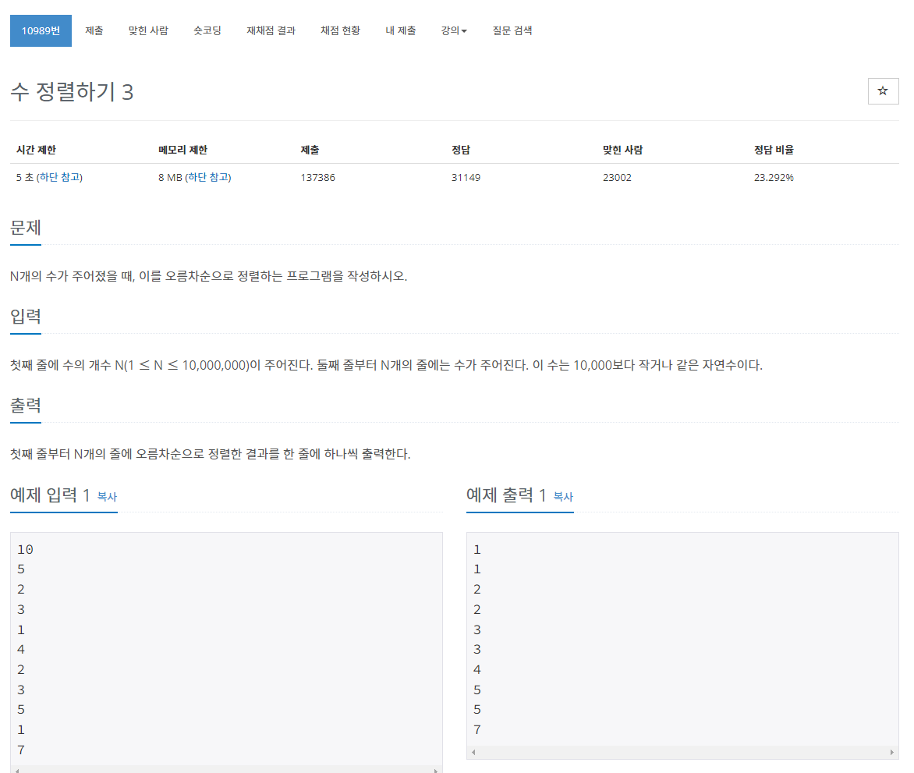
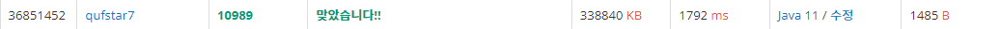
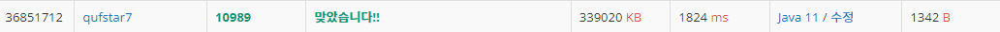

> 백준 알고리즘 - '단계별로 풀어보기'를 기준으로 학습, 정리하였습니다.(https://www.acmicpc.net/)
# 단계 
## 정렬

# N10989 수 정렬하기 3

## 문제

수의 범위가 작다면 카운팅 정렬을 사용하여 더욱 빠르게 정렬할 수 있습니다.
* 수의 개수가 최대 10,000,000

### 카운팅 정렬
counting sort
* O(n+k) 의 시간복잡도
  * k는 정렬할 수 중 최대값
  * 즉 k가 크면 클수록 시간복잡도가 크다(무한대가능)
* 각 숫자가 몇 번 등장했는지 세어 주는 정렬
* 요소 값끼리 비교하지 않는다.
> https://www.cs.miami.edu/home/burt/learning/Csc517.091/workbook/countingsort.html

#### 카운팅 정렬 용어 설명
* input array : 정렬 대상 배열
* counting array : 각 숫자의 개수를 세는 배열
  * counting array 배열의 크기는 input array 요소들 중 최대값 +1 로 정한다.
  * 요소의 최대값을 알지 못할 경우 재귀적 방법을 사용한다.
* output array : 정렬 결과 배열

#### 카운팅 정렬을 위한 의사 코드
1. counting array을 모두 0으로 초기화
2. input array에서 각 요소의 개수를 셈(counting array에다 저장)
3. 각 요소의 개수를 제공하기 위해 counting array를 수정(누적합)
4. counting array에서 제공하는 위치 정보를 이용해 input array에서 output array로 숫자 전송 (input array의 뒤에서 부터 위치 정보를 이용해 정렬하며 숫자를 하나씩 뺌.)

## 풀이
```java
import java.io.*;

public class Main { // 수 정렬하기 3

	public static void main(String[] args) throws NumberFormatException, IOException {
		BufferedReader br = new BufferedReader(new InputStreamReader(System.in));
		int N = Integer.parseInt(br.readLine());

		// 입력 배열
		int[] inputArr = new int[N];
		for (int i = 0; i < N; i++) {
			inputArr[i] = Integer.parseInt(br.readLine());
		}

		// k값(정렬할 값 중 최댓값) 구하기
		int k = inputArr[0];
		for (int i = 0; i < inputArr.length; i++) {
			if (k < inputArr[i]) {
				k = inputArr[i];
			}
		}
			
		// countingArr, outputArr 선언
		int[] countingArr = new int[k + 1];
		int[] outputArr = new int[N];

		// 1. countingArr 초기화
		for (int i = 0; i < k + 1; i++) {
			countingArr[i] = 0;
		}

		// 2. 각 요소 개수 세기
		int temp = 0;
		for (int i = 0; i < N; i++) {
			temp = inputArr[i];
			countingArr[temp]++;
		}

		// 3. 누적합으로 교체
		for (int i = 1; i < k + 1; i++) {
			countingArr[i] = countingArr[i] + countingArr[i - 1];
		}

		// 4. 위치, 개수 정보를 이용해 요소 정렬
		int temp2 = 0;
		int temp3 = 0;
		for (int i = N - 1; i >= 0; i--) {
			temp2 = inputArr[i];
			countingArr[temp2]--;
			temp3 = countingArr[temp2];
			outputArr[temp3] = temp2;
		}

		// outputArr 출력
		StringBuilder sb = new StringBuilder();		
		for (int i = 0; i < outputArr.length; i++) {
			sb.append(outputArr[i]);
			sb.append("\n");
		}		
		System.out.println(sb);	
		
	}
}
```

* countingArr 배열의 크기를 설정하기 위한 k값을 처음에 N으로 했다가 카운팅 정렬에 대한 이해를 위한 시간을 많이 쓰고 제대로 구할 수 있었다.
* 카운팅 정렬의 성능은 k의 값, 즉 정렬하고자 하는 배열의 최댓값에 크게 영향을 받는다는 것을 체감했다.
* 문제의 조건이 가장 큰수가 10000이므로 k를 10000으로 설정하여 해도 된다.
  * k값을 10000으로 한 코드의 결과
    

## 타인의 답(숏코딩)
>https://www.acmicpc.net/source/32999201
```java
import java.io.*;
class Main{
	public static void main(String[] args) throws IOException {
		BufferedReader br=new BufferedReader(new InputStreamReader(System.in));
		StringBuilder sb=new StringBuilder();
		int N=Integer.parseInt(br.readLine()), a[]=new int[10001];
		while(N-->0) a[Integer.parseInt(br.readLine())]++;
		br.close();
		for(int i=1;i<=10000;i++) {
			while(a[i]>0) {sb.append(i).append('\n'); a[i]--;}
		}
		System.out.println(sb);
	}
}
```
* 카운팅 정렬을 아주 간결하게 구현하였다. 보고 배우자.