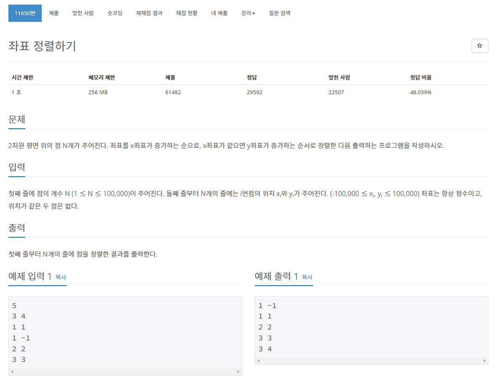

> 백준 알고리즘 - '단계별로 풀어보기'를 기준으로 학습, 정리하였습니다.(https://www.acmicpc.net/)
# 단계 
## 정렬

# N11650 좌표 정렬하기

## 문제

## 풀이
```java
import java.io.BufferedReader;
import java.io.IOException;
import java.io.InputStreamReader;
import java.util.Arrays;
import java.util.StringTokenizer;

public class Main { // 좌표 정렬하기

	public static void main(String[] args) throws NumberFormatException, IOException {
		BufferedReader br = new BufferedReader(new InputStreamReader(System.in));
		int N = Integer.parseInt(br.readLine());

		int[][] arr = new int[N][2];
		StringTokenizer st;

		for (int i = 0; i < N; i++) {
			st = new StringTokenizer(br.readLine());
			arr[i][0] = Integer.parseInt(st.nextToken());
			arr[i][1] = Integer.parseInt(st.nextToken());
		}

		Arrays.sort(arr, (e1, e2) -> {
			if (e1[0] == e2[0]) {
				return e1[1] - e2[1];
			} else {
				return e1[0] - e2[0];
			}
		});

		StringBuilder sb = new StringBuilder();
		for (int i = 0; i < N; i++) {
			sb.append(arr[i][0]).append(" ").append(arr[i][1]).append("\n");
		}

		System.out.println(sb);
	}
}
```
* BufferedReader로 입력을 받고 StringTokenizer로 문자열을 나누고 StringBuilder로 문자열 생성 후 출력
* Arrays.sort()와 람다식을 이용해 정렬 및 우선순위를 정의해준다.  
    `sort(arr, (e1,e2) - >) {if() return e1[1] - e2[1] else{ return e1[0] - e2[0]}});`
> [참고 자료 : St-lab](https://st-lab.tistory.com/110)

### 람다식
(매개변수 1, ...) -> {함수;}
```java
// 람다식 X
int c = sum(a, b);
public int sum(int a, int b) {
	return a + b;
}
 
// 람다식 O
int c = (int a, int b) -> {return a + b;}
```
* 함수의 이름없이 람다식으로 구현한 함수를 일명 익명함수라고 하기도 한다.

### Arrays.sort()에 람다식 사용
> [sort​(T[] a, Comparator<? super T> c) - java 11](https://docs.oracle.com/en/java/javase/11/docs/api/java.base/java/util/Arrays.html#sort(T[],java.util.Comparator))
* 2가지 인자를 받을 수 있다.
  1. `T[] a `
      * 제너릭타입 객체배열 - 타입 상관없이 배열(클래스, 객체, 자료형 등)
  1. `Comparator<? super T>c`
      * <? super T>c : 상속관계에 있는 타입만 자료형으로 받는다는 뜻.  T타입이 자식클래스가 되고 T의 상속관계에 있는 타입까지만 혀용하겠다는 의미. 생략가능
      * 람다식으로 표현 가능 

* Comparator를 람다식으로 표현해 x와 y의 비교 우선순위를 정해준다.
* Arrays.sort()를 Comparator를 사용하여 객채를 정렬하는 경우 Tim sort 방식(merge sort, insertion sort 혼용)으로 정렬

#### java debug step into e1, e2
```java
step 1 :
    e1 [0] = 1, [1] = 1
    e2 [0] = 3, [1] = 4
step 2 :
    e1 [0] = 1, [1] = -1
    e2 [0] = 1, [1] = 1
step 3 :
    e1 [0] = 2, [1] = 2
    e2 [0] = 1, [1] = -1

arr sort step 1 : (1,-1) (1,1) (3,4) (2,2) (3,3)

step 4 :
    e1 [0] = 2, [1] = 2
    e2 [0] = 1, [1] = 1
step 5 :
    e1 [0] = 2, [1] = 2
    e2 [0] = 3, [1] = 4
    
arr sort step 2 : (1,-1) (1,1) (2,2) (3,4) (3,3)

step 6 :
    e1 [0] = 3, [1] = 3
    e2 [0] = 2, [1] = 2
step 7 :
    e1 [0] = 3, [1] = 3
    e2 [0] = 3, [1] = 4
            
arr sort step 3 : (1,-1) (1,1) (2,2) (3,3) (3,4)    
```
* e1, e2는 익명객체로 2차원배열 arr의 익명 객체 배열이다.
* arrays.sort()메소드가 익명함수 e1,e2를 비교하면서 정렬한다. 
* 정렬과정에서 e1,e2는 2차원배열 arr의 행 2개를 순차적으로 의미하게 되며 정렬에 사용된다.
* 그 과정에서 e1[0]과 e2[0]가 같으면( x좌표가 같으면) y좌표를 비교한다.
  
#### Compare 함수와 return 값의 이해
* compare 함수를 통해 두 원소 e1, e2의 크기(우선순위)에 따른 값이 반환
* 선행 원소(e1)가 후행 원소(e2)보다 작다면 음수값을, 서로 같다면 0을, 선행 원소(e1)가 후행 원소보다 크다면 양수를 반환.
* 그래서 -1, 0, 1이라고 보통 배우는 것도 이러한 두 원소의 대소 비교값을 쉽게 이해하기 위해 그렇게 쓴다. 정확히는 음수, 0, 양수값.
```
if(e1[0] < e2[0]) {
return -1;
}
else if(e1[0] == e2[0]) {
return 0;
}
else {
return 1;
}
```
* 굳이 if문으로 나누지 않고 수식으로 표현하면 이렇게 만들 수 있다.
***`return e1[0] - e2[0];`***

#### 익명객체 
* 단독으로 생성할 수 없고 클래스를 상속하거나 인터페이스를 구현해야만 생성 가능하다.
* 주로 필드의 초기값이나 로컬변수의 초기값, 매개 변수의 매개값으로 주로 대입된다.
* 익명자식객체에서 재정의된 필드나 메소드는 외부에서 사용할 수 없다.