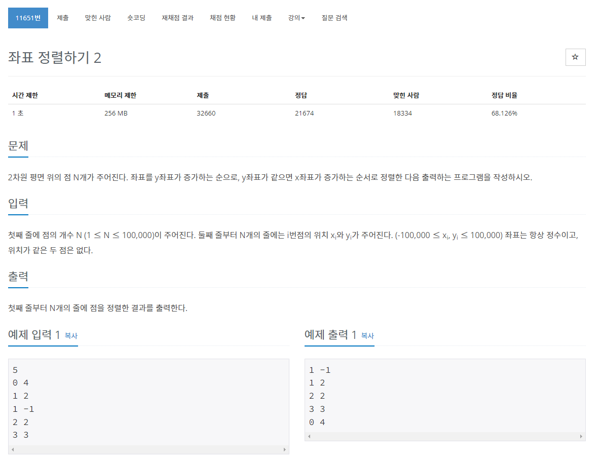

> 백준 알고리즘 - '단계별로 풀어보기'를 기준으로 학습, 정리하였습니다.(https://www.acmicpc.net/)
# 단계 
## 정렬

# N11651 좌표 정렬하기 2

## 문제

* 좌표 정렬하기 1과 x, y의 우선순위만 다르다
## 풀이
```java
package sorting;

import java.io.BufferedReader;
import java.io.IOException;
import java.io.InputStreamReader;
import java.util.Arrays;
import java.util.StringTokenizer;

public class N11651 { // 좌표 정렬하기 2

	public static void main(String[] args) throws NumberFormatException, IOException {
		BufferedReader br = new BufferedReader(new InputStreamReader(System.in));
		int N = Integer.parseInt(br.readLine());

		int[][] arr = new int[N][2];
		StringTokenizer st;

		for (int i = 0; i < N; i++) {
			st = new StringTokenizer(br.readLine());
			arr[i][0] = Integer.parseInt(st.nextToken());
			arr[i][1] = Integer.parseInt(st.nextToken());
		}

		Arrays.sort(arr, (e1, e2) -> {
			if (e1[1] == e2[1]) {
				return e1[0] - e2[0];
			} else {
				return e1[1] - e2[1];
			}
		});

		StringBuilder sb = new StringBuilder();
		for (int i = 0; i < N; i++) {
			sb.append(arr[i][0]).append(" ").append(arr[i][1]).append("\n");
		}

		System.out.println(sb);
	}

}
```
* 조건문을 수정하여 y가 같으면 x좌표를 비교하고 그 외에는 y를 우선순위로 정렬하게 하였다.

## 파이썬 풀이
```py
import sys
input = sys.stdin.readline
n = int(intput())
a = []
for i in range(n):
	x, y = map(int, input().split())
	a.append([y, x])
s = sorted(a)
for y, x in s:
	print(x, y)
```
* sys.stdin.readline으로 입력시간을 줄인다
* a 리스트로 초기화
* map으로 x, y를  int로 입력받음
* y를 기준으로 정렬되게 a 리스트에 y,x 순서로 append