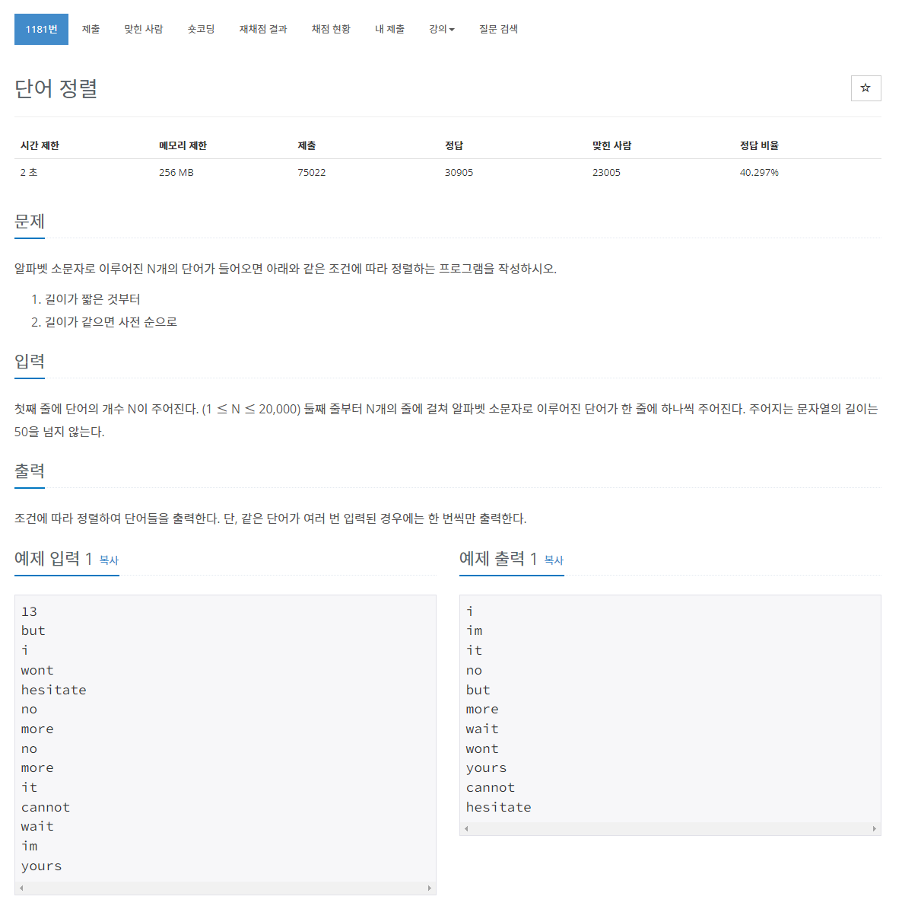

> 백준 알고리즘 - '단계별로 풀어보기'를 기준으로 학습, 정리하였습니다.(https://www.acmicpc.net/)
# 단계 
## 정렬

# N1181 단어 정렬

## 문제

## 풀이
```java
import java.io.BufferedReader;
import java.io.IOException;
import java.io.InputStreamReader;
import java.util.Arrays;

public class Main {

	public static void main(String[] args) throws NumberFormatException, IOException {

		BufferedReader br = new BufferedReader(new InputStreamReader(System.in));
		int N = Integer.parseInt(br.readLine());

		String[] a = new String[N];
		for (int i = 0; i < N; i++) {
			a[i] = br.readLine();
		}

		Arrays.sort(a, (s1, s2) -> {
			if (s1.length() == s2.length()) {
				return s1.compareTo(s2);
			} else {
				return s1.length() - s2.length();
			}
		});
		
		System.out.println(a[0]);
		for (int i = 1; i < a.length; i++) {			
			if(a[i].equals(a[i-1])) continue;
			System.out.println(a[i]);
		}
		
	}

}
```
* 입력 값을 String 배열에 저장하고 Arrays.sort()와 람다식을 이용해 정렬하였다.
### 조건문 설명
* 길이가 같으면(길이차 0) compareTo()함수를 이용해 사전 순 정렬하였다. 
  * 
* 그외의 경우 길이 차를 비교하여 음수/양수를 리턴하여 정렬하게 하였다.

### compareTo()
* compareTo() 함수는 java에서 두 값을 비교해 int형의 값을 반환한다.
* 숫자형 비교시 0(동일) 또는 -1(작다) 또는 1(크다)을 반환한다.
  * Integer.compare() 함수로 int형으로 선언함과 동시에 비교할 수 있다.
* 문자형 비교시 0(동일) 또는 양수/음수의 문자열 길이의 차이값을 반환한다.
* 길이의 차이값이 같은대 동일한 문자열이 아닌 경우 같지 않은 문자의 아스키 차이값을 반환한다.
  * ex) abcd와 abef를 비교시 c, e 아스키 값 비교 99 - 102 = -3
  * ex) abcd와 zbcd를 비교시 97 - 122 즉, a의 아스키 값에서 z의 아스키 값을 뺀 값인 -25를 반환한다.
* compareTo()는 대소문자도 당연히 구분한다.(아스키값이 다르다.)