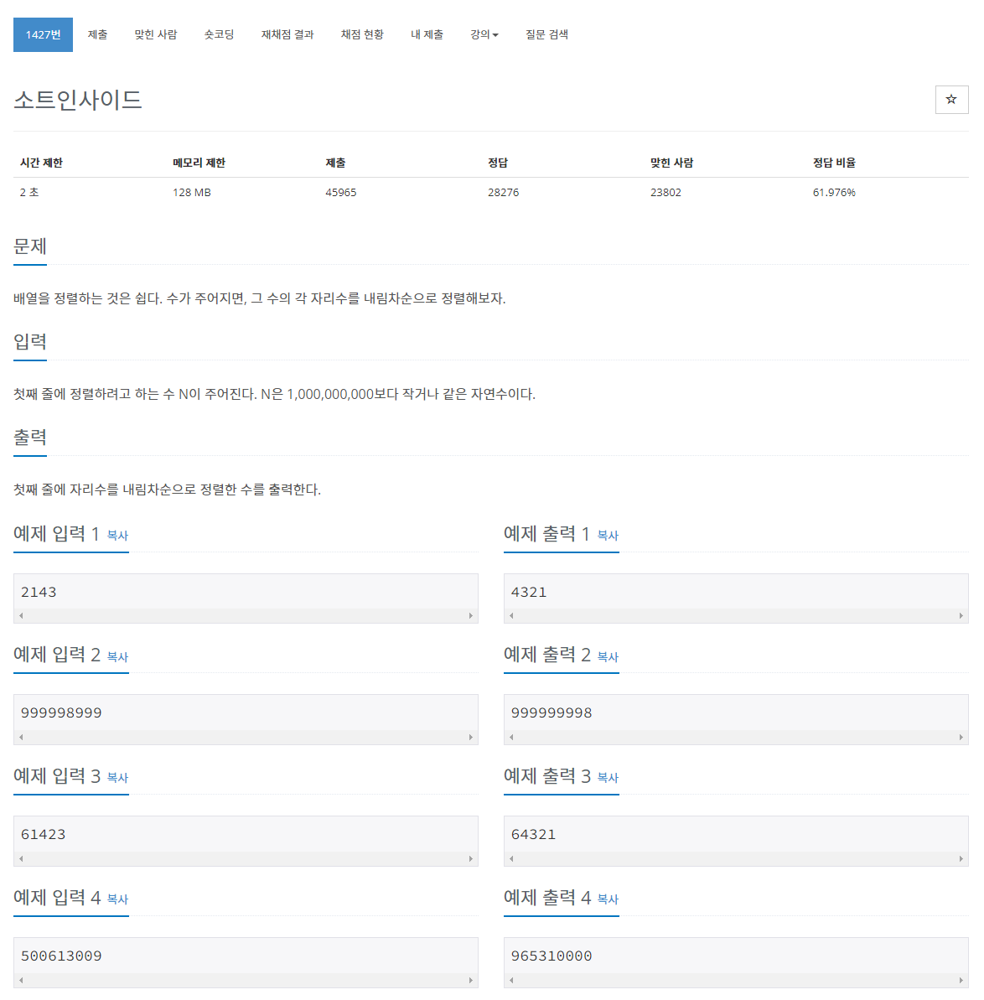

> 백준 알고리즘 - '단계별로 풀어보기'를 기준으로 학습, 정리하였습니다.(https://www.acmicpc.net/)
# 단계 
## 정렬

# N1427 소트인사이드

## 문제


## 풀이
```java
import java.io.*;
import java.util.*;

public class Main {

	public static void main(String[] args) throws NumberFormatException, IOException {
		BufferedReader br = new BufferedReader(new InputStreamReader(System.in));
		ArrayList<Integer> numbers = new ArrayList<Integer>();
		while (true) {
			int temp = br.read() - 48;
			if (temp == -35) {
				break;
			}
			numbers.add(temp);
		}
		Collections.sort(numbers);
		Collections.reverse(numbers);
		for (int i = 0; i < numbers.size(); i++) {
			System.out.print(numbers.get(i));
		}
	}
}
```
* 메모리 초과.

```java
import java.io.*;

public class test {

	public static void main(String[] args) throws NumberFormatException, IOException {
		BufferedReader br = new BufferedReader(new InputStreamReader(System.in));
		StringBuilder sb = new StringBuilder();
		
		// 카운팅배열, 입력
		int[] a = new int[10];
		while (true) {
			int temp = br.read() - 48;
			if (temp < 0 || temp > 9) {
				break;
			}
			a[temp]++;
		}

		// 정렬 및 출력
		for (int i = 9; i >= 0; i--) {
			while (a[i] > 0) {
				sb.append(i);
				a[i]--;
			}
		}
		System.out.println(sb);

	}
}
```
* k, 즉 정렬하고자 하는 값의 최댓값이 9이므로 카운팅 정렬이 효율적이다.
* 값 입력시 \r\w가 입력되므로 (ASCII코드 10, 13) 해당 값이 입력되지 않도록 한다.
* 내림차순이므로 정렬 및 출력시 9부터 0순으로 동작하게 한다.