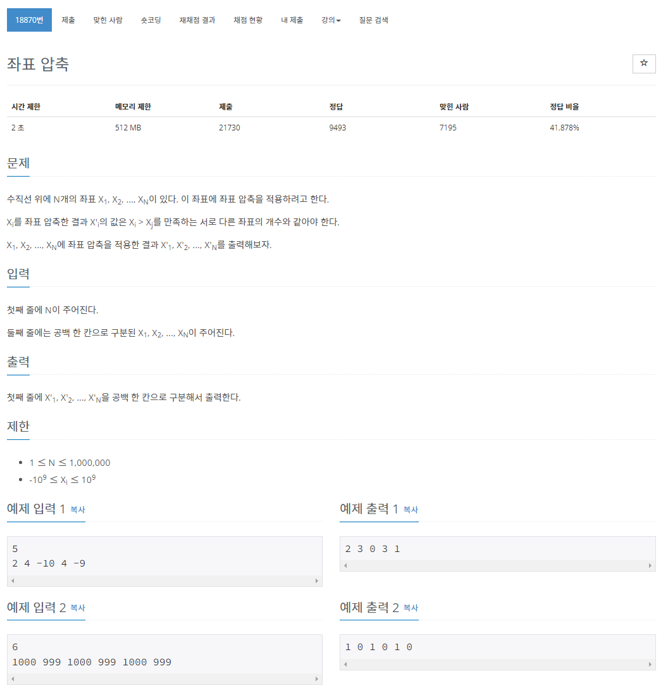

> 백준 알고리즘 - '단계별로 풀어보기'를 기준으로 학습, 정리하였습니다.(https://www.acmicpc.net/)
# 단계 
## 정렬

# N18870 좌표 압축

## 문제


## 좌표 정렬
> https://medium.com/algorithms-digest/coordinate-compression-2fff95326fb

coordinate compression    
간격 및/또는 중복 정보를 제거하여 많은 점 집합을 더 작은 범위에 매핑하는 기술  
주로 데이터의 범위가 크거나 단순화가 필요할 경우 주로 사용한다.  
  * GPS 좌표 압축( 2차원 3차원 데이터를 그리드로 놓고 보았을 때 데이터 값들을 단순화하여 압축하거나 특정 공식에 의해 무소신실 압축을 하는등 데이터의 양을 압축시키는 방식등이 있다.)
* 1D 좌표 압축
  * 순위 매기기 
  * ex) N개의 숫자 배열을 [0, N-1] 범위에 매핑
* 2D 좌표 압축 
  * 데이터 압축

## 풀이
```java
import java.io.BufferedReader;
import java.io.IOException;
import java.io.InputStreamReader;
import java.util.Arrays;
import java.util.HashMap;
import java.util.Map;

public class Main {

	public static void main(String[] args) throws NumberFormatException, IOException {
		BufferedReader br = new BufferedReader(new InputStreamReader(System.in));
		int N = Integer.parseInt(br.readLine());
		String[] arr = br.readLine().split(" ");
		int[] a = new int[N];
		for (int i = 0; i < N; i++) {
			a[i] = Integer.parseInt(arr[i]);
		}

		int[] a2 = a.clone();
		Arrays.sort(a2);

		Map<Integer, Integer> map = new HashMap<>();
        int idx = 0;
        for (int n : a2)
            if (!map.containsKey(n))
                map.put(n, idx++);

        StringBuilder sb = new StringBuilder();
        for (int n : a)
            sb.append(map.get(n)).append(' ');

        System.out.println(sb.toString());
	}
}
```
1. 입력을 받은 뒤 형변환하여 배열에 저장한다.
2. 클론 배열을 만들고 정렬한다.
3. HashMap을 생성해 중복되지 않은 경우 원소와 순위를 저장한다.
4. 원본배열의 원소의 키값에 대한 순위를 가져와 출력한다.