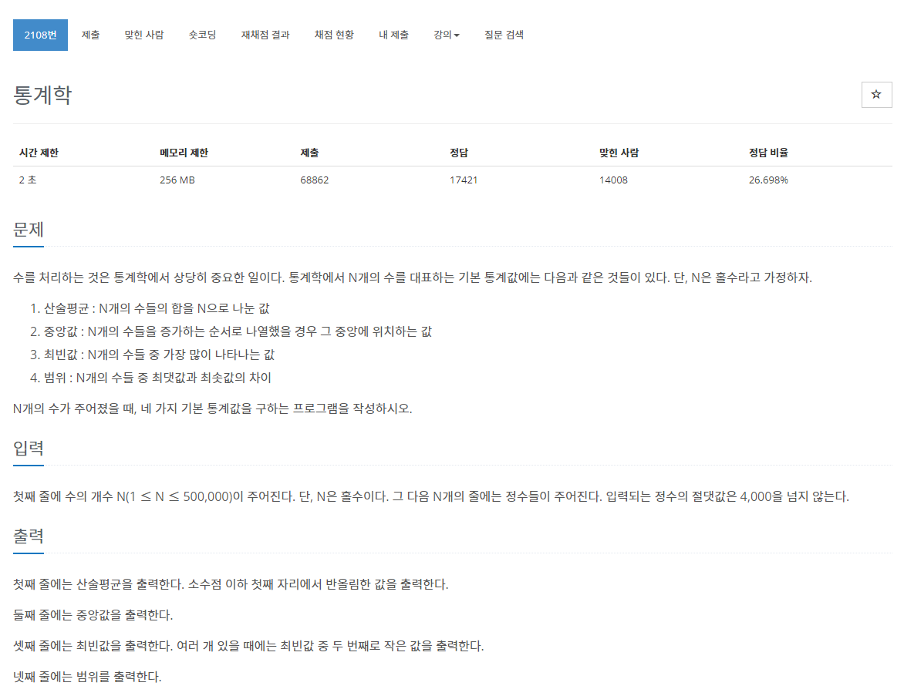
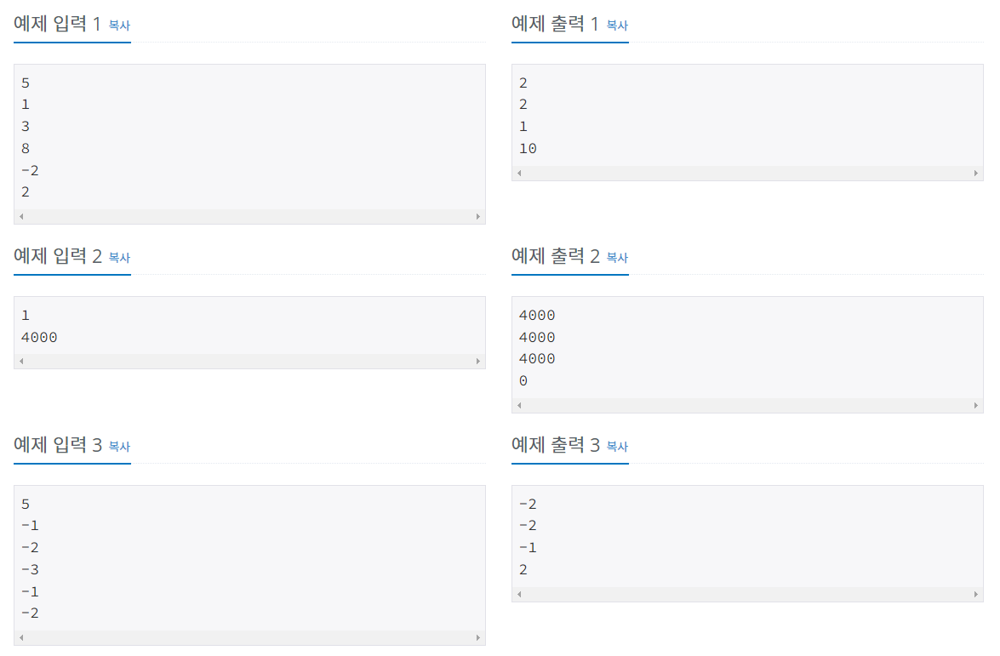

> 백준 알고리즘 - '단계별로 풀어보기'를 기준으로 학습, 정리하였습니다.(https://www.acmicpc.net/)
# 단계 
## 정렬

# N2108 통계학

## 문제
  


## 풀이 
```java
package sorting;

import java.io.*;
import java.util.*;

public class N2108 {

	public static void main(String[] args) throws NumberFormatException, IOException {

		BufferedReader br = new BufferedReader(new InputStreamReader(System.in));
		int N = Integer.parseInt(br.readLine()), a[] = new int[N];

		for (int i = 0; i < N; i++) {
			a[i] = Integer.parseInt(br.readLine());
		}

		Arrays.sort(a);

		// 산술평균
		int sum = 0;
		for (int i = 0; i < a.length; i++) {
			sum += a[i];
		}
		double temp = Math.round((double) sum / N);
		int mean = (int) temp;

		// 중앙값
		int median = a[N / 2];
		
		
		// 범위
		int range = 0;
		range = a[N - 1] - a[0];

		System.out.println(mean);
		System.out.println(median);
		System.out.println(mode);
		System.out.println(range);

	}

}
```
* Arrays.sort()로 중앙값을 구함

```java
import java.io.*;

public class Main {

	public static void main(String[] args) throws NumberFormatException, IOException {

		BufferedReader br = new BufferedReader(new InputStreamReader(System.in));
		int N = Integer.parseInt(br.readLine());

		int[] a = new int[8001];
		int sum = 0;
		int max = Integer.MIN_VALUE; // -4001
		int min = Integer.MAX_VALUE; // 4001

		for (int i = 0; i < N; i++) {
			int v = Integer.parseInt(br.readLine());
			a[v + 4000]++; // 음의 정수는 0~3999, 양의 정수는 4001~8001에 값의 빈도수 저장
			sum += v;
			if (max < v) {
				max = v;
			}
			if (min > v) {
				min = v;
			}
		}
		// 산술평균
		int mean = (int) Math.round((double) sum / N); // 소수점 이하 첫째 자리 반올림

		// 중앙값
		int count = 0;
		int median = 0;
		for (int i = min + 4000; i <= max + 4000; i++) {
			if (a[i] > 0) {
				if (count < (N + 1) / 2) {
					count += a[i];
					median = i - 4000;
				}
			}
		}

		// 최빈값
		int max_mode = 0;
		int mode = 0;
		boolean TOF = false;
		for (int i = min + 4000; i <= max + 4000; i++) {
			if (a[i] > 0) {
				if (max_mode < a[i]) {
					max_mode = a[i];
					mode = i - 4000;
					TOF = true;
				} else if (max_mode == a[i] && TOF == true) { // 최빈값이 여러 개 있을 때는 두 번째로 작은 값 출력
					mode = i - 4000;
					TOF = false;
				}
			}
		}

		// 범위
		int range = max - min;

		System.out.println(mean);
		System.out.println(median);
		System.out.println(mode);
		System.out.println(range);

	}
}
```
* 산술평균 계산시 형변환에 주의
* 최빈값 계산에 카운팅 정렬을 이용
* 최빈값이 여러 개 있을 경우 주의
* 중앙값을 계산시 Arrays.sort()를 사용하면 간단하게 코딩가능,
  * 하지만 Nlog(N)의 시간복잡도, 카운팅정렬이 N의 복잡도를 가지므로 10개 이상의 숫자를 정렬하는 경우, 더 느리다.

## 개념 정리
1. 산술평균(avg, mean) : sum/N
2. 중앙값(median) : a[(N+1)/2]
3. 최빈값(mode) : counting sort를 이용해 각 숫자 종류별 빈도 수를 배열에 저장 후 비교
4. 범위 : max - min

## 파이썬 풀이
```py
import sys 
from collections import Counter

N = int(sys.stdin.readline())

numbers = []
for _ in range(N):
    numbers.append(int(sys.stdin.readline()))
    
def mean(nums):
    return round(sum(nums) / len(nums))

def median(nums):
    nums.sort()
    mid = nums[len(nums) / 2]
    
    return mid

def mode(nums):
    mode_dict = Counter(nums)
    modes = mode_dict.most_common()    
    
    if len(nums) > 1 : 
        if modes[0][1] == modes[1][1]:
            mod = modes[1][0]
        else : 
            mod = modes[0][0]
    else : 
        mod = modes[0][0]

    return mod
        
def scope(nums):
    return max(nums) - min(nums)

print(mean(numbers))
print(median(numbers))
print(mode(numbers))
print(scope(numbers))
```
* 개수를 세는 Counter 라이브러리 사용
* 최빈값
  * 정렬을 시키고 하나씩 앞의 요소와 비교
  * 같으면 +_ 다르면 현재 값 dict에 저장