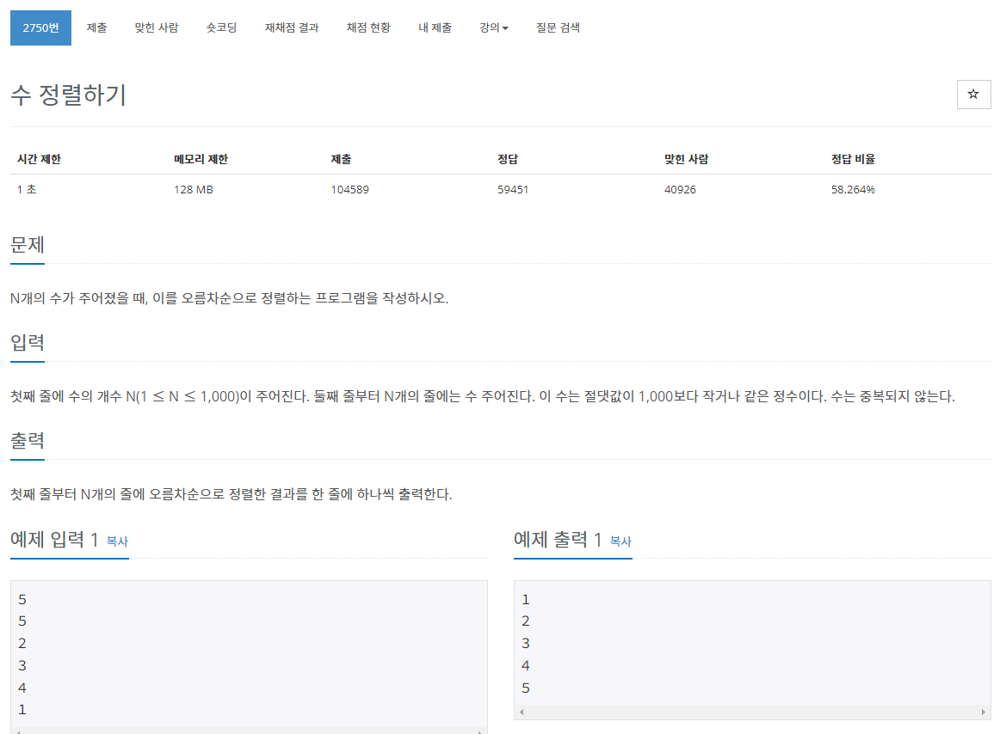

> 백준 알고리즘 - '단계별로 풀어보기'를 기준으로 학습, 정리하였습니다.(https://www.acmicpc.net/)
# 단계 
## 정렬

# N2750 수 정렬하기

## 문제

## 풀이
Arrays.sort() 메서드를 사용하면 쉽게 풀 수 있다.

```java
package sorting;

import java.io.*;
import java.util.Arrays;

public class N2750 { // 수 정렬하기

	public static void main(String[] args) throws NumberFormatException, IOException {
		BufferedReader br = new BufferedReader(new InputStreamReader(System.in));
		int N = Integer.parseInt(br.readLine());
		int[] arr = new int[N];
		for (int i = 0; i < N; i++) {
			arr[i] = Integer.parseInt(br.readLine());
		}
		Arrays.sort(arr);
		for (int i = 0; i < arr.length; i++) {
			System.out.println(arr[i]);
		}
	}

}
```
* for문을 사용하여 입출력.
* StringBuilder를 사용하여 한번에 출력하면 조금 더 성능이 좋다.
  ```java
  StringBuilder sb = new StringBuilder();
  for(int i = 0; i < arr.length; ++i) {
      sb.append(arr[i]+"\n");
  }
  System.out.println(sb.toString());
  ```
## 추가사항
* 다중차순의 경우 compareTo() 메서드를 사용

### 삽입정렬
* insertion sort
* 자료 배열의 모든 요소를 앞에서부터 차례대로 이미 정렬된 배열 부분과 비교하여 자신의 위치를 찾아 삽입함으로써 정렬
* O(n2)
  * 선택 정렬이나 거품 정렬과 같은 같은 O(n2) 알고리즘에 비교하여 빠르며, 안정 정렬이고 in-place 알고리즘
* 작은 리스트, 대부분 정렬된 리스트에 상대적으로 효율적인 단순한 정렬 알고리즘
* cf) 셸소트
  
#### 삽입 정렬로 문제 풀어보기
```java
for (int idx = 1; idx < arr.length; idx++) {
    int temp = arr[idx];
    int aux = idx - 1;
    while ( (aux >= 0) && (arr[aux] > temp) ) {
        arr[aux+1] = arr[aux];
        aux--;
    }
    arr[aux+1] = temp;
}
```

### 거품 정렬
* bubble sort
* 두 인접한 원소를 검사하여 정렬
* O(n2)
* cf) 칵테일 정렬
  
#### 거품 정렬로 문제 풀어보기
```java
int temp = 0;
for (int i = 0; i < arr.length - 1; i++) {
    for (int j = 1; j < arr.length - i; j++) {
        if (arr[j] < arr[j-1]) {
            temp = arr[j-1];
            arr[j-1] = arr[j];
            arr[j] = temp;
        }
    }
}
```
* 배열의 앞 요소 부터 2개씩 비교하되 마지막 2요소를 비교하면 다시 처음부터 2개씩 비교한다(중첩 for문 사용)
* 한 바퀴 돈 이후(첫 for문 i = 0 이 끝난 후) 가장 큰 수가 제일 뒤에 위치하게 되므로 두 번째 for문의 범위는 arr.length - i 까지만 탐색한다. (각 라운드마다 탐색 범위가 줄어든다.)

## 최종 정리 코드
```java
package sorting;

import java.io.*;
import java.util.*;

public class N2750 { // 수 정렬하기

	public static void main(String[] args) throws NumberFormatException, IOException {
		BufferedReader br = new BufferedReader(new InputStreamReader(System.in));
		int N = Integer.parseInt(br.readLine());
		int[] arr = new int[N];
		
		for (int i = 0; i < N; i++) {
			arr[i] = Integer.parseInt(br.readLine());
		}
		
		// 정렬 메소드 사용
		Arrays.sort(arr);
		
		// 삽입 정렬
		for (int idx = 1; idx < arr.length; idx++) {
			int temp = arr[idx];
			int aux = idx - 1;
			while ( (aux >= 0) && (arr[aux] > temp) ) {
				arr[aux+1] = arr[aux];
				aux--;
			}
			arr[aux+1] = temp;
		}
		
		// 거품 정렬
		int temp = 0;
		for (int i = 0; i < arr.length - 1; i++) {
			for (int j = 1; j < arr.length - i; j++) {
				if (arr[j] < arr[j-1]) {
					temp = arr[j-1];
					arr[j-1] = arr[j];
					arr[j] = temp;
				}
			}
		}
		
		for (int i = 0; i < arr.length; i++) {
			System.out.println(arr[i]);
		}
		
	}

}
```