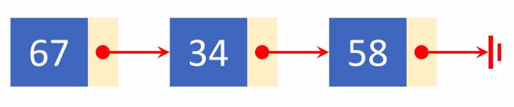
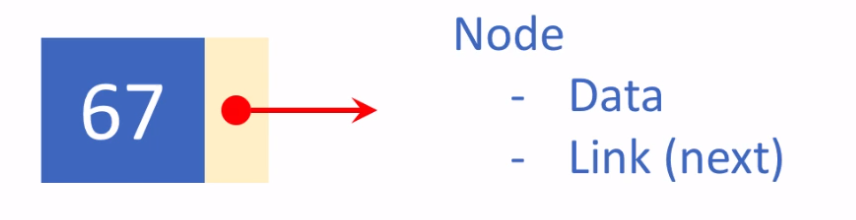
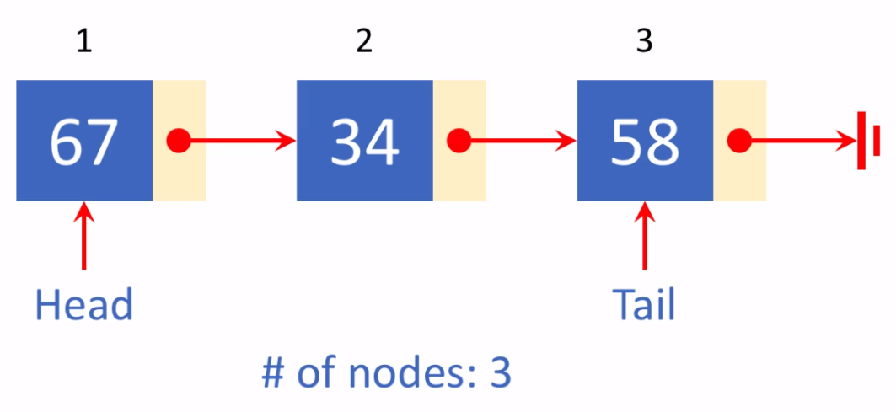
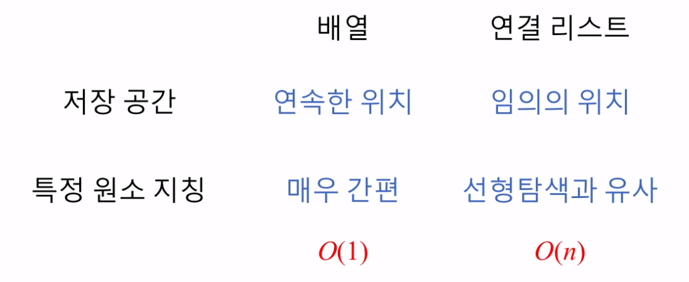
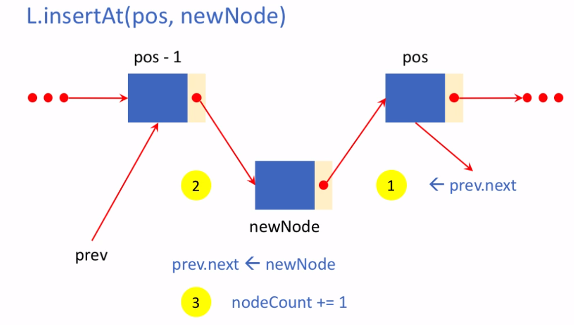

> 프로그래머스 - '자료구조와 알고리즘' 강의를 학습, 정리하였습니다.(https://programmers.co.kr/learn/courses/57)
 
# Programmers basic lecture 
Data structure and algorithm with python3

# 5.연결리스트
- [Programmers basic lecture](#programmers-basic-lecture)
- [5.연결리스트](#5연결리스트)
- [파트7. 연결 리스트(Linked Lists) (1)](#파트7-연결-리스트linked-lists-1)
  - [추상적 자료구조](#추상적-자료구조)
  - [연결리스트](#연결리스트)
  - [기본적 연결리스트](#기본적-연결리스트)
    - [노드](#노드)
    - [알고 있어야 할 정보들](#알고-있어야-할-정보들)
    - [이런 연결리스트의 정보들과 연결리스트에 적용될 수 있는 연산들을 뭉뚱그려 집어 넣을 수 있으면 연결리스트의 추상적 자료구조가 된다.](#이런-연결리스트의-정보들과-연결리스트에-적용될-수-있는-연산들을-뭉뚱그려-집어-넣을-수-있으면-연결리스트의-추상적-자료구조가-된다)
  - [연결리스트의 추상적 자료구조 만들기](#연결리스트의-추상적-자료구조-만들기)
  - [실습 : 특정 원소 참조](#실습--특정-원소-참조)
    - [코드](#코드)
- [curr이 연결리스트의 첫번째 노드인 head를 가리키도록 함](#curr이-연결리스트의-첫번째-노드인-head를-가리키도록-함)
  - [배열과 비교한 연결 리스트](#배열과-비교한-연결-리스트)
  - [실습: 연결 리스트 순회 구현하기](#실습-연결-리스트-순회-구현하기)
    - [문제 설명](#문제-설명)
    - [풀이](#풀이)
- [파트8. 연결 리스트(Linked Lists) (2)](#파트8-연결-리스트linked-lists-2)
  - [1. 원소의 삽입](#1-원소의-삽입)
    - [메서드 insertAt](#메서드-insertat)
    - [n번째에 newNode 삽입](#n번째에-newnode-삽입)
    - [newNode 삽입의 과정 3단계](#newnode-삽입의-과정-3단계)
    - [원소 삽입 코드 구현 - 프로토타입](#원소-삽입-코드-구현---프로토타입)
    - [주의사항](#주의사항)
    - [원소 삽입 코드 구현 - 수정본](#원소-삽입-코드-구현---수정본)
    - [원소 삽입 코드 구현 - 완성본](#원소-삽입-코드-구현---완성본)
  - [연결 리스트 원소 삽입의 복잡도](#연결-리스트-원소-삽입의-복잡도)
  - [2. 원소의 삭제](#2-원소의-삭제)
    - [메서드 popAt](#메서드-popat)
    - [n번째 node 삭제 (데이터 추출)](#n번째-node-삭제-데이터-추출)
    - [주의사항](#주의사항-1)
  - [코드](#코드-1)
  - [연결리스트 원소 삭제의 복잡도](#연결리스트-원소-삭제의-복잡도)
  - [연결 리스트 연산 - 두 리스트의 연결](#연결-리스트-연산---두-리스트의-연결)
    - [메서드 `concat`](#메서드-concat)
  - [연결리스트의 장단점](#연결리스트의-장단점)
  - [`linkelist.py` 파일을 통한 연습](#linkelistpy-파일을-통한-연습)
  - [실습: 연결 리스트 노드 삭제하기](#실습-연결-리스트-노드-삭제하기)
    - [문제 설명](#문제-설명-1)
- [파트9. 연결 리스트(Linked Lists) (3)](#파트9-연결-리스트linked-lists-3)
  - [실습: dummy head 를 가지는 연결 리스트 노드 삭제](#실습-dummy-head-를-가지는-연결-리스트-노드-삭제)
- [파트10. 양방향 연결 리스트(Doubly Linked Lists)](#파트10-양방향-연결-리스트doubly-linked-lists)
  - [실습: (1) 양방향 연결 리스트 역방향 순회](#실습-1-양방향-연결-리스트-역방향-순회)
  - [실습: (2) 양방향 연결 리스트 노드 삽입](#실습-2-양방향-연결-리스트-노드-삽입)
  - [실습: (3) 양방향 연결 리스트 노드 삭제](#실습-3-양방향-연결-리스트-노드-삭제)
  - [실습: (4) 양방향 연결 리스트의 병합](#실습-4-양방향-연결-리스트의-병합)

<small><i><a href='http://ecotrust-canada.github.io/markdown-toc/'>Table of contents generated with markdown-toc</a></i></small>


# 파트7. 연결 리스트(Linked Lists) (1)
## 추상적 자료구조
* Abstract Data Structures
* 자료구조의 내부 구현은 숨겨두고 밖에서 보이는 것들 2가지를 제공하는 자료구조
    1. 데이터(Data)
       * 예: 정수, 문자열, 레코드(데이터들의 묶음), ...
    2. 일련의 연산들(A set of operations)
       * 삽입, 삭제, 순회(특정한 순서로 각 자료들을 방문하는, 꺼내는), ...
       * 정렬, 탐색(특정 원소를 찾는), ...
* 데이터들의 일련의 연산을 추상적으로 보여주는 자료구조를 추상적 자료구조라고 한다.
## 연결리스트
* 자료구조의 일종
* 연결리스트는 데이터 원소들을 순서를 지어 늘어놓는다는 점에서 선형배열과 비슷하지만 데이터 원소를 늘어 놓는 방식에서 차이가 있다. 
  * 선형 배열은 "번호가 붙여진 칸에 원소들을 채워넣는 방식"
  * 연결리스트는 "각 원소들을 줄줄이 엮어서 관리하는 방식"
## 기본적 연결리스트

* 예시 : 3개의 데이터 아이템들이 순서를 지어 연결되어 있고 앞의 데이터가 뒤의 데이터를 가리키도록 되어있는 리스트  
### 노드
* 각각의 아이템들

* data와 Link의 정보를 담고있다.
* Node 내의 데이터는 다른 구조로 이루어질 수 있다.
### 알고 있어야 할 정보들
* Head: 리스트의 맨 앞
  * 리스트를 찾는데 사용
* Tail: 리스트의 맨 끝
  * 리스트의 맨 끝에 덧붙일 때 사용
* `# of nodes`: 3
  * 노드의 개수
### 이런 연결리스트의 정보들과 연결리스트에 적용될 수 있는 연산들을 뭉뚱그려 집어 넣을 수 있으면 연결리스트의 추상적 자료구조가 된다.

## 연결리스트의 추상적 자료구조 만들기
1. 2개의 클래스(2개의 자료구조) 만들기
    1. `Node`
        * data, link
        ```py
        class Node:
          def __init__(self, item):
              self.data = item
              self.next = None
        ```
    2. `LinkedLisk`
        * nodeCount, head, tail
        ```py
        class LinkedList:
            def __init__(self):
                self.nodeCount = 0
                self.head = None
                self.tail = None
        ```
* 위 2개의 자료구조에 특정 연산들을 수행하면 연결리스트의 속성을 가지도록 할 수 있다.   
2. 연산 정의
   1. 특정 원소 참조(k번째)
   2. 리스트 순회
   3. 길이 얻어내기
   4. 원소 삽입
   5. 원소 삭제
   6. 두 리스트 합치기

## 실습 : 특정 원소 참조
* 주어진 연결리스트에서 k번째 원소를 참조하는 연산을 구현해 보자
* 위의 연결리스트 예제를 사용하였다.
* 3개의 노드로 이루어진 단순한 연결리스트
* 노드들의 번호를 1,2,3으로 임의로 정해주었다(0부터 시작 x, 이유는 차후에 0을 다른 용도로 사용하기 위해)


### 코드
* LinkedList의 메소드 `getAt(self, pos)` 
* pos번째에 있는 노드를 return
```py
def getAt(self, pos):
    if pos <= 0 or pos > self.nodeCount:
        return None
    i = 1
    curr = self.head 
    while i < pos: 
        curr = curr.next
        i += 1
    return curr
```
# curr이 연결리스트의 첫번째 노드인 head를 가리키도록 함
* 만약 번호가 0보다 작거나같고 노드 개수보다 큰 수 이면 return None
* 그렇지 않으면
* i = 1, current는 head를 가리키도록 함.
* i가 pos보다 작은 동안 i를 하나씩 증가시키면서 curr를 curr의 next를 가리키도록 하면, 즉 pos-1만큼 전진하면
그때 curr가 가리키고 있는 것이 내가 리턴하려는 pos번째 노드를 가리키게 될 것
1. pos가 1이면 i = 1, curr = 67, while(1<1)실행 x return curr(67)
2. pos가 2이면 i = 1, curr = 67, while 1<2 curr = curr.next = 67.next = 34, i = 2, 2<2 while문 종료. return curr(34)
3. pos가 3이면 i = 1, curr = 67, while (1<3, curr = 34, i = 2). (2<3, curr = 58, i = 3). (3<3) while문 종료. return curr(58)
4. pos가 0보다 작거나 같은 수 이거나, 3보다 큰 수 일 경우 return None

## 배열과 비교한 연결 리스트

* 선형배열과 연결리스트 비교
1. 저장공간(메모리)
   * 배열은 연속한 위치에 데이터가 놓여야 한다. 
   * 그래야만 k 번째 라고 했을 때 단칼에 그 위치를 처음으로부터 떨어진 거리를 이용해 찾아갈 수 있다.
   * 연결리스트는 각 노드들이 링크로 연결되어 있기 때문에
   * 노드들이 임의의 위치에 있어도 된다.
2. 특정 원소 지칭
   * 배열의 경우 몇 번째라는 index만 지정하면 바로 찾을 수 있다. 상수 시간 $O(1)$이 걸린다
   * 연결리스트의 경우 앞에서 부터 하나하나 링크를 따라가야 하기 때문에 선형탐색과 유사하다. n에 비례하는 시간 $O(n)$이 걸린다.(linear time algorithm)


## 실습: 연결 리스트 순회 구현하기
* list traversal
* head 부터 tail까지 다음 노드들을 찾아가는 방식으로 구현
### 문제 설명
제 7 강에서 소개된 추상적 자료구조로 LinkedList 라는 이름의 클래스가 정의되어 있다고 가정하고, 이 리스트를 처음부터 끝까지 순회하는 메서드 traverse() 를 완성하세요.

메서드 traverse() 는 리스트를 리턴하되, 이 리스트에는 연결 리스트의 노드들에 들어 있는 데이터 아이템들을 연결 리스트에서의 순서와 같도록 포함합니다. 예를 들어, LinkedList L 에 들어 있는 노드들이 43 -> 85 -> 62 라면, 올바른 리턴 값은 [43, 85, 62] 입니다.

이 규칙을 적용하면, 빈 연결 리스트에 대한 순회 결과로 traverse() 메서드가 리턴해야 할 올바른 결과는 [] 입니다.

[참고] "실행" 을 눌렀을 때 통과하는 것은 아무 의미 없습니다.

### 풀이
```py
class Node:
    def __init__(self, item):
        self.data = item
        self.next = None

class LinkedList:
    def __init__(self):
        self.nodeCount = 0
        self.head = None
        self.tail = None

    def traverse(self):
        list = []
        curr = self.head
        while curr != None:
            list.append(curr.data)
            curr = curr.next
        return list
```


# 파트8. 연결 리스트(Linked Lists) (2)
* 연결리스트에서 노드의 삽입과 삭제를 구현해보자
## 1. 원소의 삽입

### 메서드 insertAt
* `def insertAt(self, pos, newNode)`
  * pos가 가리키는 위치에(`1<=pos<=nodeCount+1`) newNode를 삽입하고
  * 결과의 성공/실패에 따라 True/False를 리턴
### n번째에 newNode 삽입
* 예를 들어 'n'번째에 'newNode'원소를 삽입한다면
  * 'n'번째의 뒤에 있는 원소들은 한 칸씩 뒤로 밀고 n-1번째 까지는 그냥 남아 있을 것.
  * 'n-1'번째 원소와 'n'번째 원소 사이에 'newNode'원소를 삽입한다.
### newNode 삽입의 과정 3단계
* 'n-1'번 node를 찾고 prev라 부르기로 한다.
1. newNode의 뒤 쪽 링크 조정
   * `n`번 node를 newNode의 next link가 가리키도록 한다.
2. prev가 newNode를 가리키게 한다.
   * newNode를 prev.next가 가리키도록 한다.
3. nodeCount를 1만큼 증가

### 원소 삽입 코드 구현 - 프로토타입
```py
def insertAt(self, pos, newNode):
    prev = self.getAt(pos - 1)
    newNode.next = prev.next
    prev.next = newNode
    self.nodeCount += 1
```
### 주의사항
1. 삽입하려는 위치가 리스트 맨 앞일 때
   * prev 없음
   * Head 조정 필요
2. 삽입하려는 위치가 리스트 맨 끝일 때
   * Tail 조정 필요 
* 빈 리스트에 삽입할 때 > 위 2개의 조건에 의해 처리가 된다. 
### 원소 삽입 코드 구현 - 수정본
```py
def insertAt(self, pos, newNode):
    if pos < 1 or pos > self.nodeCount +1:
        return False

    if pos == 1:
        newNode.next = self.head
        self.head = newNode

    else:
        prev = self.getAt(pos - 1)
        newNode.next = prev.next
        prev.next = newNode

    if pos == self.nodeCount + 1:
        self.tail = newNode

    self.nodeCount += 1
    return True
```
* 삽입하려는 위치가 리스트 맨 끝일 때, 즉 `pos == nodeCount+1`인 경우
  * `prev == tail`이다.
  * 맨 앞에서부터 찾아갈 필요가 없다.
### 원소 삽입 코드 구현 - 완성본
```py
def insertAt(self, pos, newNode):
    if pos < 1 or pos > self.nodeCount +1:
        return False

    if pos == 1:
        newNode.next = self.head
        self.head = newNode

    else:
        if pos == self.nodeCount + 1:
            prev = self.tail
        else:
            prev = self.getAt(pos - 1)
        newNode.next = prev.next
        prev.next = newNode

    if pos == self.nodeCount + 1:
        self.tail = newNode

    self.nodeCount += 1
    return True
```
## 연결 리스트 원소 삽입의 복잡도
* 맨 앞에 삽입하는 경우 : $O(1)$
* 중간에 삽입하는 경우 : $O(n)$
* 맨 끝에 삽입하는 경우 : $O(1)$
  * tail을 유지해서 상수시간이 걸린다.

## 2. 원소의 삭제
단순 삭제 뿐 아니라 삭제하기 위해 추출한 데이터를 리턴한다.
### 메서드 popAt
* `def popAt(self, pos)`
  * pos가 가리키는 위치에(`1 <= pos <= nodeCount`) node를 삭제하고
  * 그 node의 데이터를 리턴
### n번째 node 삭제 (데이터 추출)
* 예를 들어 'n'번째 원소를 삭제한다면
  * 'n-1' 원소와 'n+1' 원소 사이의 원소를 뽑아서 그 데이터를 리턴
    * 'n-1' 원소를 찾아서 prev라는 변수를 가리키게 한다.
    * 'n'번 원소 curr를 뽑는데
    * `prev.next <- curr.next` 링크를 조정한다.
    * 그리고 데이터를 꺼내서 리턴
    * nodeCount를 1만큼 감소
### 주의사항
1. 삭제하려는 node가 맨 앞의 것일 때
   * prev 없음
   * Head 조정 필요
2. 리스트 맨 끝의 node를 삭제할 때(`pos == nodeCount`)
   * Tail 조정 필요
   * 한번에 처리 x(prev를 찾을 수 없다), 앞에서부터 찾아와야 한다.
* 유일한 노드를 삭제할 때
  * 위 2개의 조건에 의해 처리되는가?
  * Head와 Tail 모두 위 2개의 조건에 의해 None을 가리키게 되고 처리되는 줄 알았지만
  * 사실 리스트길이가 1인 리스트의 유일한 원소를 지우면 Head와 tail이 더이상 가리키지 않아야되는데 그 원소를 가리키게 된다. 따라서 조건문 추가.

## 코드
```py
def popAt(self, pos):
    if pos < 1 or pos > self.nodeCount:
        return False
                
    prev = self.getAt(pos - 1)
    curr = self.getAt(pos)
    
    if pos == 1: # 맨 앞 삭제
        if self.nodeCount==1: # 유일한 노드 삭제
            self.head=None
            self.tail=None
        self.head = curr.next
                                
    elif pos == self.nodeCount: # 맨 끝 삭제
            self.tail = prev
            prev.next = None
    else: 
        prev.next = curr.next
        
    self.nodeCount -= 1
    return curr.data
```

## 연결리스트 원소 삭제의 복잡도
* 맨 앞에 삽입하는 경우 : $O(1)$
* 중간에 삽입하는 경우 : $O(n)$
* 맨 끝에 삽입하는 경우 : $O(n))$

## 연결 리스트 연산 - 두 리스트의 연결
### 메서드 `concat`
* 연결 리스트 self의 뒤에 또 다른 연결 리스트인 L을 이어 붙임
* `L1.concat(L2)`
  * L1.tail이 L2.Head를 가리키게
  * self.tail = L2.tail
    ```py
    def concat(self, L):
        self.tail.next = L.head
        self.tail = L.tail
        self.nodeCount += L.nodeCount
    ```
    * 뒤에 붙이는 리스트가 빈 리스트일 경우 tail이 None값이 되어 버리기 때문에 조건문 필요
    ```py
    def concat(self, L):
        self.tail.next = L.head
        if L.tail: # L.tail != None
            self.tail = L.tail
        self.nodeCount += L.nodeCount
    ```
## 연결리스트의 장단점
* 단점 
  * 특정 연산들이 오래 걸린다.
  * 인덱싱 x, 따라서 특정 노드를 지칭하는데 길이에 비례하는 시간이 걸린다는 단점
* 장점
  * 삽입과 삭제를 유연하게 할 수 있다.
  * 병합도 array에서는 할 수 없는 방법

## `linkelist.py` 파일을 통한 연습
```powershell
>>> from linkedlist import *
>>> a = Node(67)
>>> b = Node(34) 
>>> c = Node(28)
>>> L = LinkedList()
>>> L
LinkedList: empty
>>> L.insertAt(1,a)
True
>>> L.insertAt(2,b)
True
>>> L.insertAt(3,c)
True
>>> L
67 -> 34 -> 28
```

## 실습: 연결 리스트 노드 삭제하기
### 문제 설명
제 8 강에서 소개된 추상적 자료구조 LinkedList 클래스의 메서드로서 popAt() 메서드를 강의 내용에 소개된 요구조건을 만족시키도록 구현하세요.

초기 코드로 들어 있는 것은 solution() 함수를 포함하여 다른 부분은 수정하지 말고, def popAt(self, pos): 의 메서드 몸체만 구현하세요.

만약, 인자로 주어진 pos 가 올바른 범위의 값을 가지지 않는 경우에는 IndexError exception 을 발생시키도록 합니다. 이렇게 하기 위한 코드는 raise IndexError 입니다.

*** 2020년 3월 23일, 학습자의 질문에 답하면서 보니 특정한 경우의 정확성을 올바르게 검증하지 못하는 경우가 발견되어 테스트 케이스 4 번을 추가했습니다.


# 파트9. 연결 리스트(Linked Lists) (3)


## 실습: dummy head 를 가지는 연결 리스트 노드 삭제


# 파트10. 양방향 연결 리스트(Doubly Linked Lists)


## 실습: (1) 양방향 연결 리스트 역방향 순회


## 실습: (2) 양방향 연결 리스트 노드 삽입


## 실습: (3) 양방향 연결 리스트 노드 삭제


## 실습: (4) 양방향 연결 리스트의 병합